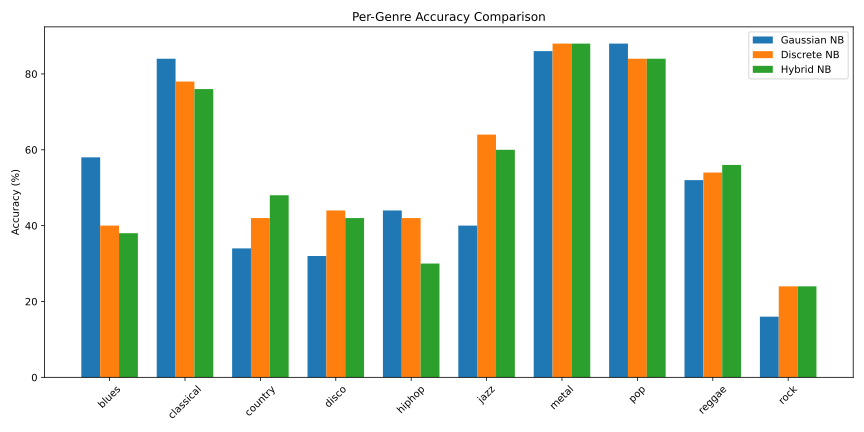
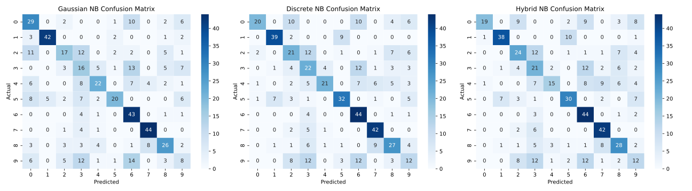

# Music Genre Classification with Naive Bayes

This project attempts to solve the genre classification problem by using a Naive Bayes Classifier.

There are three types of Bayes classifiers explored in this project:

- Gaussian Naive Bayes (GNB):  assumes features follow a Gaussian distribution.
- Discrete Naive Bayes (DNB): discretizes continuous features into bins for categorical probabilities.
- Hybrid Naive Bayes (HNB): automatically chooses Gaussian or Discrete treatment per feature based on skewness.


## Data
The classifier uses the GTZAN Music Genre Dataset. The data is split for training and test.

GTZAN Music Genre Dataset: [https://www.kaggle.com/datasets/andradaolteanu/gtzan-dataset-music-genre-classification](https://www.kaggle.com/datasets/andradaolteanu/gtzan-dataset-music-genre-classification)

The dataset contains track-level audio features:
- Spectral features: chroma_stft_mean/var, spectral_centroid_mean/var, spectral_bandwidth_mean/var, rolloff_mean/var, zero_crossing_rate_mean/var
- Harmonic features: harmony_mean/var, perceptr_mean/var
- MFCCs: mfcc1_mean/var … mfcc20_mean/var

## Pipeline
- Load dataset
- Train/test split (50/50, stratified by genre)
- Normalization of features
- Train Naive Bayes models: GNB, DNB, HNB
- Evaluation: Overall accuracy; Per-genre accuracy; Confusion matrices


## Results
The classifiers achieve around **50–60%** accuracy on raw features. Hybrid NB slightly outperforms Gaussian and Discrete NB by automatically handling skewed features. Per-genre accuracy and confusion matrices are plotted for analysis.

The relatively low accuracy is expected. Naive-Bayes works by considering independent features and this is not taken intro account. Also, the features may not follow a Gaussian distribution necessarily and discretizing the features loses precision.

As we can observe in the plots below, certain genres are classified with high accuracy (i.e. classical, metal, etc.). This is due to the fact that these genres are distinct, while genres like rock, pop, country, blues have similar elements and may have very close features.



## Running Instructions

- Activate the python environment:
```bash
source ./env/bin/activate
pip install -r requirements.txt
```
